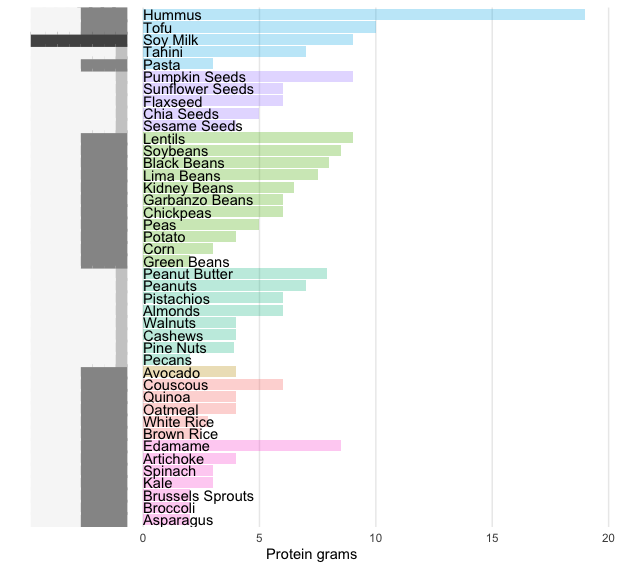

# Plant-Based Nutrition
Plant-Based Nutrients Exploratory Data Analysis
 (some other food may appear just as matter of comparison)

Main data source: [SR27 collection by USDA](https://www.ars.usda.gov/northeast-area/beltsville-md-bhnrc/beltsville-human-nutrition-research-center/methods-and-application-of-food-composition-laboratory/mafcl-site-pages/sr11-sr28/)

 

  Visualization made from data at 
    <a href="https://www.vegetarianproteinlist.com/">https://www.vegetarianproteinlist.com/</a>
    

